# Count RNA\-Seq Reads Using Biopipeline Designer

This example shows how to build a bioinformatics pipeline to count the number of reads mapped to genes identified by Cufflinks using a sample paired\-end RNA\-Seq data for chromosome 4 of the Drosophila genome.

# Open Biopipeline Designer App

At the MATLAB® command line, enter:

```
biopipelineDesigner
```
# Select Data Files

The example uses chromosome 4 of the Drosophila genome as a reference (`Dmel_chr4.fa`). It also uses a sample paired\-end data provided with the toolbox (`SRR6008575_10k_1.fq` and `SRR6008575_10k_2.fq`). Use a FileChooser block for each of these files to load the data into the app.

## Create FileChooser Block for Reference Sequence

In the **Block Library** pane of the app, scroll down to the **General** section. Drag and drop a **FileChooser** block onto the diagram.


 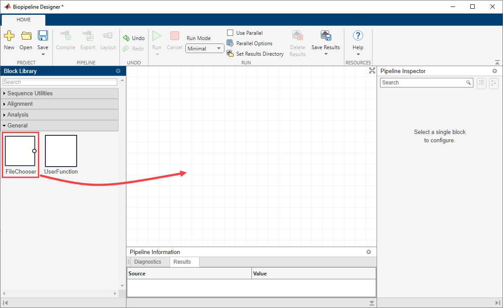


Run the following command at the MATLAB command line to create a variable that contains the full file path to the provided reference sequence.

```
refSeq = which("Dmel_chr4.fa");
```

In the app, click the **FileChooser** block. In the **Pipeline Inspector** pane, under **FileChooser Properties**, click the vertical three\-dot menu next to the **Files** property. Select **Assign from workspace**.


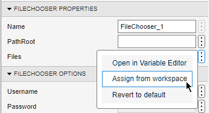


Select **refSeq** from the list. Click **OK**.


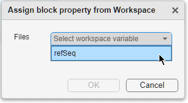

## Create FileChooser Blocks for Paired\-End Data

There are two sample files (`SRR6008575_10k_1.fq` and `SRR6008575_10k_2.fq`) provided with the toolbox that contain RNA\-Seq data for pair\-end reads. You need to create a **FileChooser** block for each file.


First, run the following commands at the MATLAB command line to create two variables that contain the full file path to the provided files.

```
reads1 = which("SRR6008575_10k_1.fq");
reads2 = which("SRR6008575_10k_2.fq");
```

In the app, drag and drop two **FileChooser** blocks. Click **FileChooser\_2** and set its **Files** property to the `reads1` variable and `reads2` for **FileChooser\_3** (following the similar steps you did for the reference sequence `refSeq` previously).

# Build Reference Genome Indices

Generate indices for the reference genome files before aligning the reads to it. Use a **Bowtie2Build** block to build such indices.


From the  **Block Library** pane, under the **Alignment** section, drag and drop the **Bowtie2Build** block onto the diagram.


Connect **FileChooser\_1** to **Bowtie2Build\_1** blocks as shown next. To connect, place your pointer at the output port of the first block and drag (an arrow) towards the input port of the second block. 


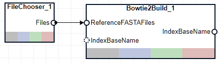

# Align Reads Using Bowtie2

Use a **Bowtie2** block as an aligner to map reads from two sample files (**FileChooser\_2** and **FileChooser\_3**) against the reference sequence.


Drag and drop a **Bowtie2** block from the **Block Library** pane. The **IndexBaseName** input port of the block takes in the base name of the index files, which is the output of the previous (or upstream) **Bowtie2Build\_1** block. The **Reads1Files** and **Reads2Files** input ports takes in the first mate and second mate reads, respectively. The **IndexBaseName** and **Reads1Files** input ports are required and must be connected, as indicated by solid circles. The **Reads2File** port is an optional port, indicated by a dotted circle, and you use it only when you have paired\-end data, such as in this example. Connect these three blocks as shown next. The **Bowtie2 Options** section of the **Pipeline Inspector** pane lists all the available alignment options. For details on each options, see [Bowtie2AlignOptions](<docid:bioinfo_ref#mw_c0c29db3-be1a-4589-890b-8409ac5379ff>).


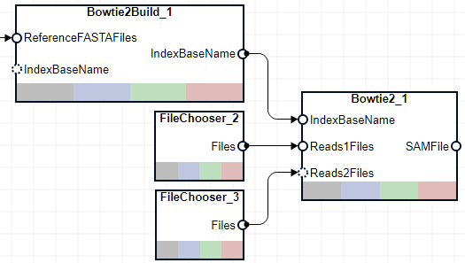

# Sort SAM Files

The next step is to use the **SamSort** block, which sorts the alignment records by the reference sequence name first and then by position within the reference. Sorting is needed because you will use the **Cufflinks** block next to assemble transcriptomes based on the aligned reads, and the block requires sorted SAM files as inputs.


Drag and drop a **SamSort** block from the **Sequence Utilities** section of **Block Library** onto the diagram. Then connect the **Bowtie2\_1** and **SamSort\_1** blocks.


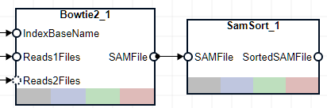

# Assemble Reads into Transcriptomes

Create a GTF (Gene Transfer Format) file from the aligned data (SAM files) to quantify transcript expression. Use the **Cufflinks** block to assemble the sorted SAM files into GTF files, which contains information on gene features, including the start and end positions of transcripts.


Drag and drop a **Cufflinks** block from the **Analysis** section of **Block Library** onto the diagram. Then connect the **SamSort\_1** and **Cufflinks\_1** blocks.


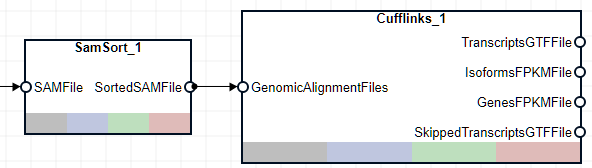

# Count Reads from Paired\-End Data

Use the **FeatureCount** block to count the number of reads in the sorted SAM file that map onto genomic features in the GTF file (**TranscriptsGTFFile**) generated by the **Cufflinks** block. Speciflcally, you will count the number of reads mapped to genes identified by **Cufflinks**.


Drag and drop a **FeatureCount** block from the **Analysis** section of **Block Library**. Then connect the three blocks (**SamSort\_1**, **Cufflinks\_1**, and **FeatureCount\_1)** as shown next: .


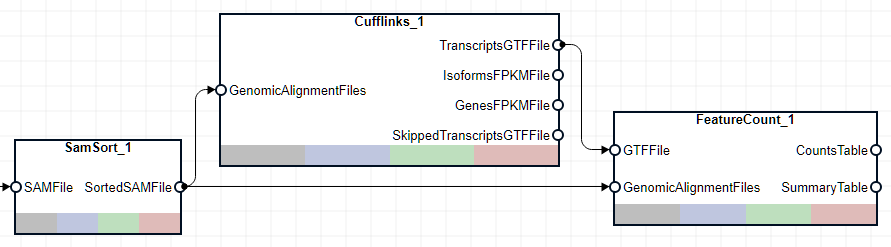

# Plot Read Counts

As the last step in this pipeline, create a custom function that plots read count results for cufflinks\-identified genes.


Go back to the MATLAB desktop. On the **Home** tab, click **New Script**. An untitled file opens in the **Editor**. Copy and paste the following code in the file that defines a custom function called `plotCounts`. The  function generates two plots. The first plot contains the read counts of each gene identified by **Cufflinks**. The second plot shows the genomic locations of these counts.

```
function plotCounts(fcCountsTable,cufflinksGenesFPKMFile)
    genesFPKMTable = readtable(cufflinksGenesFPKMFile,FileType="text");
    % Plot counts of genes identified by Cufflinks.
    figure
    geneNames = categorical(fcCountsTable.ID,fcCountsTable.ID);
    stem(geneNames, log2(fcCountsTable.Aligned_sorted))
    xlabel("Cufflinks-identified genes")
    ylabel("log2 counts")
    
    % Plot counts along their respective genomic positions.
    geneStart = str2double(extractBetween(genesFPKMTable.locus,":","-"));
    figure
    stem(geneStart,log2(fcCountsTable.Aligned_sorted))
    xlabel("Drosophila Chromosome 4 Genomic Position")
    ylabel("log2 counts")
end
```

Save the file as `plotCounts.m` in the current directory.

## Create UserFunction Block to Represent Custom Function

A **UserFunction** block can represent any existing or custom function and can be used as a block in your pipeline.


Drag and drop a **UserFunction** block from **Block Library**. In the **Pipeline Inspector** pane, under **UserFunction Properties**, update:

-  **RequiredArguments** to `CountsTable,GenesFPKMFile` 
-  **Function** to `plotCounts` 

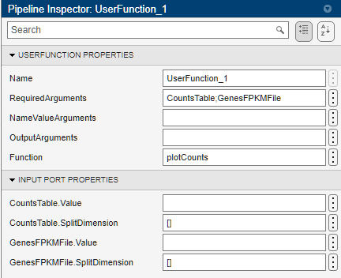


The **UserFunction\_1** block is then updated with two input ports named after the values of **RequiredArguments**.


Connect three blocks (**Cufflinks\_1**, **FeatureCount\_1**, and **UserFunction\_1**) as shown next.


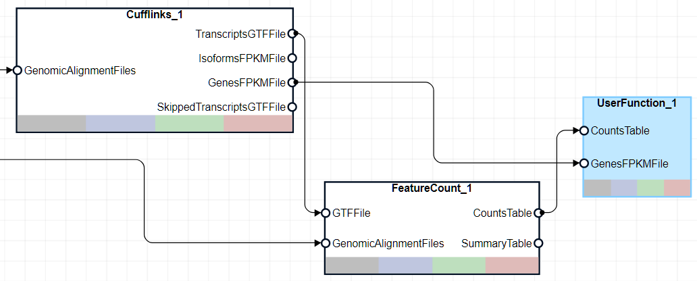

# Run Pipeline

Click **Run** on the **Home** tab of the app. The app generates the following two figures.


The first figure shows the log2 counts of each gene identified by **Cufflinks**.


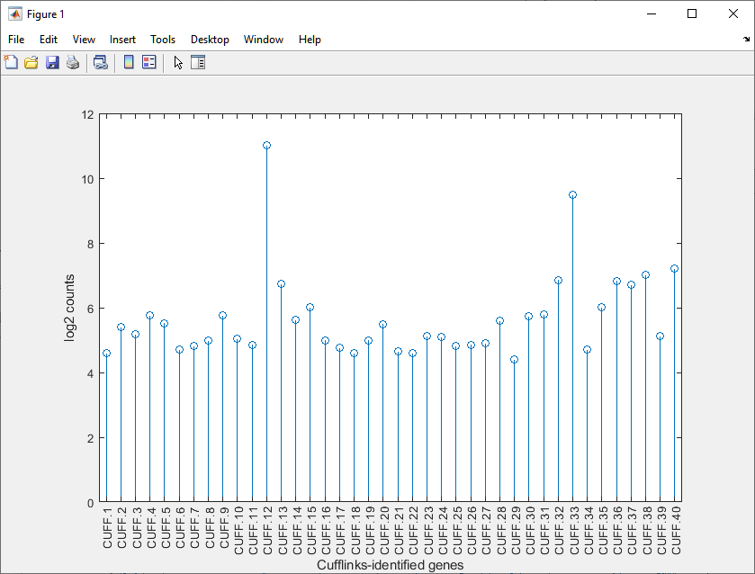


The second figure shows the individual genomic locations of these counts.


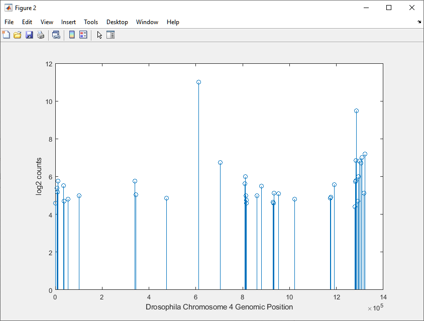

# Open Completed Pipeline

The completed pipeline is provided for your reference. 


If you have already open the live script of the example and downloaded the `countRNASeqReads.plprj` file and the `plotCounts.m` file in your current directory, run the following command.

```
biopipelineDesigner("countRNASeqReads.plprj")
```


*Copyright 2025 The MathWorks, Inc.*

